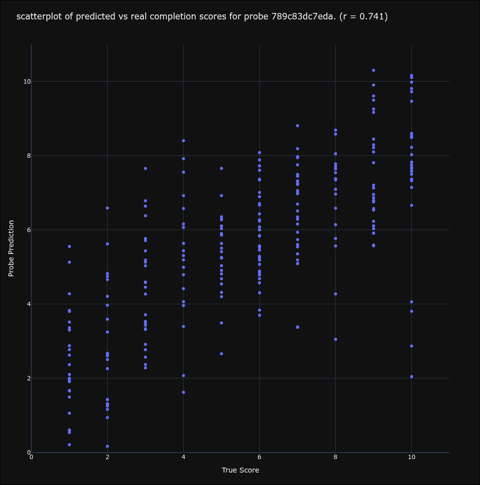
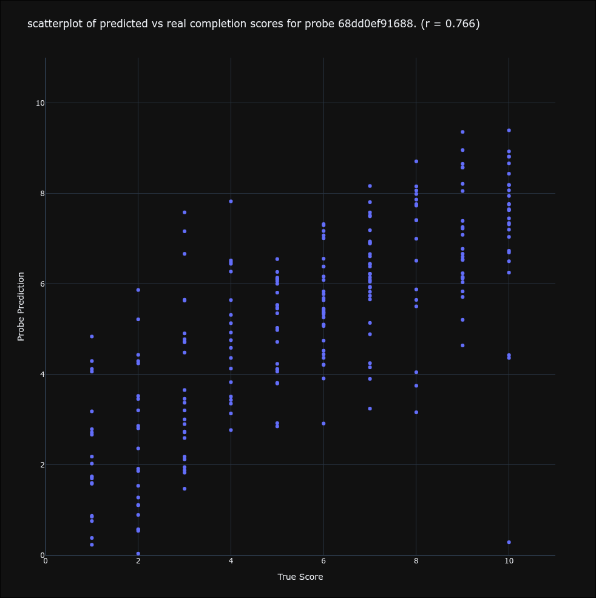

# Do RL’d models estimate anticipated rewards?

## **Executive Summary**

The goal of the project is to determine to what degree to language models that have been posttrained with RL model their expected rewards in a given situation. Models today are trained with various RL techniques, all of which center around datasets of potential model completions and some form of feedback on those completions. The question is whether these models have a sense of how favorable the current conversation is, in terms of what the RL objective has trained them to pursue. To this end, I trained models using Direct Preference Optimization on a feedback dataset, and trained probes on these models to predict the ground truth reward signal given the model’s activations.

### **Setup: General**

We take a dataset with user prompts paired with AI-rated assistant completions on a scale from 1-10. We give each prompt+completion to our subject model (we used 2 models, **Mistral** and **Qwen**), and train a probe to predict the ground truth rating of the completion. We also do DPO training on the feedback dataset, and train probes for these posttrained models. The results shown below are all from probes trained on the residual stream from the last sequence position of the model’s completion. 

## **Key Findings**

### 1: Given a model completion, linear probes can fairly accurately predict the score of that completion from an AI rater.

*Fig 0: The probe’s prediction (y) vs the ground truth rating of a completion (x)*  
*Pearson correlation (r) \= 0.765*

**2: Probes work on any kind of model, not just Instruct or RL’d models.**   
fig1 | fig2
----------------------

| Qwen | Qwen After DPO |
| -------------- | --------------- |
|  |  |

*Fig 1, 2. Left: A probe trained on Qwen before DPO. Right: A probe trained on Qwen after DPO. Both achieve very similar accuracy.*

**3: The feature direction the probes learn is at least somewhat correlated with what the model learns over training.**  
![][image4]

*Fig 3: Our probe’s predictions for completions from Mistral, Mistral after DPO, and Mistral after DPO \+ logit diff amplification.*

**4: The features the probe chooses are probably not upstream of reward seeking behavior.**  
![][image5]  
*Fig 4: Steering using the probe’s identified direction, we see a negative effect on the expected reward from the completions.*

## **Motivation**

The standard framing is that RL training turns a ‘model’ into an ‘agent’. Something that takes actions to pursue some goal or maximize a reward function, is aware of its environment, and how various actions change that environment. Based on this framing, I wished to answer questions like:

- Are there certain user prompts that models ‘like’ or ‘dislike’ to see in terms of achieving whatever proxies they’ve learned to pursue due to the RL?  
- If so, do models steer conversations to try and get the user to give them prompts they expect to be favorable? Do models strategically prompt users?  
- Can we use interp to identify examples of improper generalization of the reward function?

## **Setup**

The main dataset used was [UltraFeedback](https://huggingface.co/datasets/openbmb/UltraFeedback). This is a real world dataset of user prompts and several completions from various different models. Each response is rated on a scoring rubric by GPT-4, on **a scale from 1-10**. This dataset is used for both the probe training and the DPO. We train the probe to output values in the range \[-1, 1\]. For the DPO training, the dataset [UltraFeedback Binarized](https://huggingface.co/datasets/HuggingFaceH4/ultrafeedback_binarized) was used. This is simply a filter of UF, using the AI rater scores to label a winner/loser pair for each prompt. DPO training was performed for 2 models, **Mistral-7B-Instruct-v0.1**, and **Qwen2.5-1.5B-Instruct**. Linear probes are trained on the pre and post versions of the model, all at the **layer 16 residual stream**. Probes targeting various sequence positions in the completions were tried. These include the end of the completion, the end of user prompt, and all sequence positions.

## **Findings**

#### **1: Probes can be trained to predict completion ratings.**

![][image6]  
*Fig 0*

- Linear probes trained on layer 16 residual stream activations predict UltraFeedback AI-rater scores with Pearson r=0.765.  
- Choosing any residual stream from the early middle layers all the way to the end results in essentially the same performance.   
- Probe accuracy is highest when trained on only the final token of the assistant completion. The average error is around 2.5**.**

**1.2: Probes can be trained on most parts of the completion:**

This probe was trained to produce N predictions given the same activation from all N tokens of the assistant’s completion. 

![][image7]  
*Fig 5: Plot of error vs sequence position (0 is the start of the assistant response, not the start of the conversation)*  
![][image8]  
*Fig 6: Same plot as above, but binned*

- Strangely, it seems that forcing the probe to predict from early sequence positions, before it has seen the majority of the model’s full response, has little effect on accuracy.
